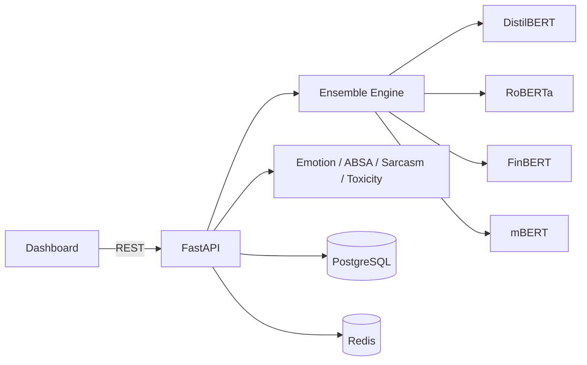

# Sentinel — Multi-Model Sentiment Analysis & NLP Intelligence Platform

<p align="center">
  
  
  
  /Multi-Model-Sentiment-Analysis-NLP-Platform/actions/workflows/ci.yml/badge.svg">
  
  
</p>

> A confidence-weighted **ensemble** of real pretrained transformer models
> (DistilBERT, Twitter-RoBERTa, FinBERT, multilingual BERT) combined with
> emotion classification, aspect-based sentiment analysis, sarcasm and
> toxicity detection, topic modeling, and time-series forecasting — exposed
> through a production-shaped FastAPI backend and a live analytics
> dashboard.

---

## Why this project is different

Most "sentiment analysis" demos wrap a single Hugging Face pipeline in a
Flask app. Sentinel instead treats sentiment as a **measurement problem**:
different models disagree, and that disagreement is itself a signal worth
surfacing — not hidden behind one overconfident label.

- Runs **4 independent sentiment models** per request and reports a
  **disagreement score** (Shannon entropy of the weighted vote) alongside
  the consensus label.
- Goes beyond positive/negative/neutral with **7-class emotion
  classification**, **aspect-based sentiment** ("camera is great, battery
  is terrible" → two separate, correctly-signed results), **sarcasm
  detection**, and **toxicity flagging**.
- Ships with a real **FastAPI + PostgreSQL + Redis** backend (JWT auth,
  RBAC roles, rate limiting, caching) — not just a notebook.
- Includes **topic modeling** (TF-IDF/NMF) and **ARIMA-based trend
  forecasting** over your analysis history.
- Fully containerized with **Docker Compose**, with **Kubernetes**
  manifests and a **CI/CD** pipeline scaffolded for production rollout.

## Screenshots

> Dashboard preview — dark, glassmorphic UI with a live model-consensus
> visualization ("constellation" view showing each model's vote converging
> on the ensemble decision).

```
┌─────────────────────────────────────────────────────────────┐
│  SENTINEL          Sentiment Intelligence Overview            │
│  ◆ Overview         ┌──────────┬──────────┬──────────┬──────┐│
│  ⌁ Analyze          │  Total   │ Avg Conf │ Dominant │ Toxic││
│  ≡ History          │   1,204  │  78.3%   │ positive │  12  ││
│  ∿ Trends           └──────────┴──────────┴──────────┴──────┘│
│  ◎ Topics           ┌────────────────────┬──────────────────┐│
│  ▲ Leaderboard       │  sentiment trend   │  label dist.     ││
│  ▤ Reports           │   (line chart)     │  (doughnut)      ││
│                       └────────────────────┴──────────────────┘│
└─────────────────────────────────────────────────────────────┘
```

Run it locally (`docker compose up`) and open `http://localhost:3000` to
see the live version, including the model-consensus constellation diagram
on the Analyze tab.

## Architecture

See [`docs/ARCHITECTURE.md`](docs/ARCHITECTURE.md) for full Mermaid
diagrams (component, sequence, ER, deployment). Summary:



## Features

| Category | What's implemented |
|---|---|
| **Multi-model ensemble** | DistilBERT-SST2, Twitter-RoBERTa, FinBERT, multilingual BERT — confidence-weighted voting + entropy-based disagreement score |
| **Emotion analysis** | 7-class emotion classifier (joy, anger, sadness, fear, surprise, disgust, neutral) |
| **Aspect-based sentiment** | Clause-splitting + noun-chunk extraction (spaCy) + per-clause sentiment scoring |
| **Sarcasm detection** | Dedicated RoBERTa sarcasm/irony classifier |
| **Toxicity detection** | Toxic-BERT — toxic / obscene / threat / insult / identity-hate sub-scores |
| **Topic modeling** | TF-IDF + NMF clustering over analysis history |
| **Trend forecasting** | Time-bucketed sentiment + ARIMA (falls back to linear regression) |
| **Model leaderboard** | Real agreement-rate-vs-consensus computed from stored history |
| **Reports** | CSV export + deterministic extractive executive summary |
| **Auth** | JWT access/refresh tokens, bcrypt password hashing, role field for RBAC |
| **Caching** | Redis, keyed by SHA-256 of input text, to skip recomputation on duplicates |
| **Dashboard** | Dark, glassmorphic single-page app — Overview, Analyze, History, Trends, Topics, Leaderboard, Reports |
| **Tests** | Pytest suite (auth flow fully tested; sentiment tests marked `model` since they require downloading real weights) |
| **DevOps** | Dockerfiles for both services, Docker Compose, Kubernetes manifests, GitHub Actions CI + image build workflows |

### Honest scope note

This repo implements a real, working core rather than every item on an
exhaustive wishlist. Specifically **not** included as live, wired-up
systems (but scaffolded with docs/config so you can build them out):
Prometheus metrics export, a RAG-powered chat assistant, a knowledge
graph, BERTopic (NMF is used instead), Slack/Discord integrations, and
live Twitter/Reddit/YouTube connectors (use `scripts/bulk_ingest.py` with
exported CSVs in the meantime). See [`ROADMAP.md`](ROADMAP.md).

## Quickstart

```bash
git clone https://github.com/<you>/Multi-Model-Sentiment-Analysis-NLP-Platform.git
cd Multi-Model-Sentiment-Analysis-NLP-Platform
bash scripts/setup.sh
```

Or manually:

```bash
cp .env.example .env   # set a real SECRET_KEY
docker compose up --build -d
```

- Dashboard → http://localhost:3000
- API docs → http://localhost:8000/docs

First request downloads the underlying HuggingFace models (~1-2 min);
subsequent requests are fast and cached.

## Example: analyzing aspect-based sentiment

```bash
curl -X POST http://localhost:8000/api/v1/sentiment/analyze \
  -H "Content-Type: application/json" \
  -d '{"text": "The camera is amazing but battery life is terrible."}'
```

```json
{
  "consensus_label": "negative",
  "consensus_score": 0.58,
  "disagreement_score": 0.91,
  "aspects": [
    {"aspect": "camera", "sentiment": "positive", "score": 0.93},
    {"aspect": "battery life", "sentiment": "negative", "score": 0.97}
  ]
}
```

Full API reference: [`docs/API.md`](docs/API.md).

## Project Structure

```
Multi-Model-Sentiment-Analysis-NLP-Platform/
├── backend/                 FastAPI app, ML services, tests
│   ├── app/
│   │   ├── api/v1/endpoints/   auth, sentiment, analytics, reports
│   │   ├── services/            ensemble, emotion, ABSA, sarcasm, toxicity, topics, trends
│   │   ├── models/               SQLAlchemy + Pydantic schemas
│   │   ├── core/                 config, security (JWT), logging
│   │   └── db/                   session, init
│   └── tests/
├── frontend/                 Single-file dark dashboard (Chart.js, no build step)
├── datasets/                 Dataset documentation + download links
├── docs/                     Architecture, API, deployment docs
├── k8s/                      Kubernetes manifests
├── monitoring/                Prometheus + Grafana scaffolding
├── scripts/                   setup.sh, bulk_ingest.py
├── portfolio_assets/          Resume bullets, elevator pitch
└── docker-compose.yml
```

## Deployment

See [`docs/DEPLOYMENT.md`](docs/DEPLOYMENT.md) for Docker Compose,
Kubernetes, and bare-metal instructions.

## Roadmap

See [`ROADMAP.md`](ROADMAP.md).

## Contributing

See [`CONTRIBUTING.md`](CONTRIBUTING.md). Issues and PRs welcome.

## Security

See [`SECURITY.md`](SECURITY.md) for how to report vulnerabilities.

## Citations / Acknowledgements

This platform builds on open pretrained models from the Hugging Face Hub,
including (but not limited to):

- `distilbert-base-uncased-finetuned-sst-2-english` (Sanh et al., 2019)
- `cardiffnlp/twitter-roberta-base-sentiment-latest` (Camacho-Collados et al.)
- `ProsusAI/finbert` (Araci, 2019)
- `j-hartmann/emotion-english-distilroberta-base`
- `unitary/toxic-bert`

See [`datasets/README.md`](datasets/README.md) for dataset sources and
licenses if you plan to fine-tune or benchmark against public corpora.

## License

MIT — see [`LICENSE`](LICENSE).
